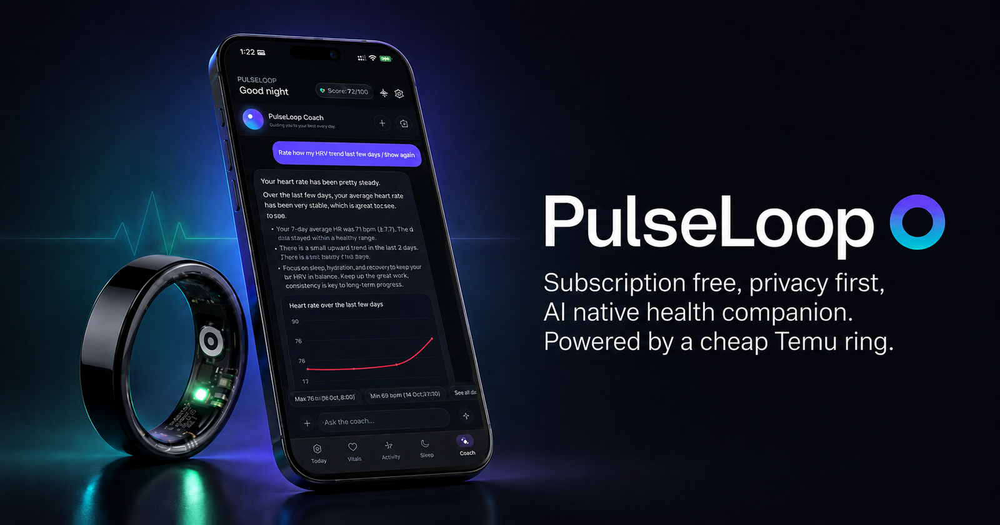

# PulseLoop



📖 Read the detailed writeup on how the app works here: [sakshambhutani.xyz/projects/20_project](https://sakshambhutani.xyz/projects/20_project/)

An LLM-native health app for iOS that turns a cheap Bluetooth "smart ring"
into a real, conversational health tracker. It currently supports the generic Chinese
Jring and the **Colmi / Yawell** ring family (R02/R0x/R1x/H59), behind a device-agnostic driver layer so
adding more wearables is straightforward.

PulseLoop talks to the ring directly over Bluetooth LE (no vendor cloud, no
account) and layers an AI **Coach** on top of your own data. Instead of
static charts, you get a coach that can read your metrics, run its own
analysis, draw charts, remember context about you, and answer questions about
your sleep, heart rate, activity, and recovery.

> **Goal:** prove that a $20 ring + an LLM can replace a $300 subscription
> wearable, and that the "intelligence" should live on the phone, not behind a
> paywall.

---

## What it does

- **Connects to the ring over BLE** and decodes its proprietary protocol
  (heart rate, SpO₂, steps, distance, calories, sleep stages, raw packets).
- **Today / Vitals / Sleep / Activity** dashboards built natively in SwiftUI,
  backed by SwiftData for local persistence.
- **AI Coach** — an agentic loop (OpenAI Responses API) with tools for data
  retrieval, on-the-fly analysis, chart generation, long-term memory, and web
  search. Every answer is grounded in your actual ring data.
- **Workout recording** with live heart-rate zones, GPS route maps, a Live
  Activity, and a Dynamic Island widget.
- **Daily check-in notifications** generated by the coach from your recent
  trends.

### Screenshots

| Today | AI Coach | Sleep |
|---|---|---|
|  |  |  |

| Activity | Vitals | Workout Summary |
|---|---|---|
|  |  |  |

---

## Supported Wearables

> **Disclaimer:** I have no affiliation with the sellers or manufacturers of
> any of the wearables listed below. I do not endorse them and take no
> responsibility for their quality, accuracy, performance, durability, data
> security, or anything else that might go wrong with them. Listings are
> provided for convenience only — links may break, sellers may swap hardware
> under the same name, change prices, and your unit may behave differently from mine. Buy at
> your own risk and treat any data the ring produces as approximate.

PulseLoop is built around a device-agnostic driver layer, so each supported ring
declares exactly what it can do and the app shows only those features. The
tables below break support down by capability.

**Support status legend**

| Status | Meaning |
|---|---|
| ✅ | **Supported & tested**: Fully verified working on real hardware |
| 🧪 | **Implemented, needs testing**: code is in place (decoded from the protocol) but not yet tested with that specific model |
| 🚧 | **Planned / not yet implemented** |
| — | **Not applicable**: the hardware doesn't expose this capability |

### Ring families

| Ring | BLE Family | Advertised name | Price | Listing |
|---|---|---|---|---|
| jring (generic smart ring) | `56ff` | `SMART_RING` | $7–12 | [AliExpress](https://www.aliexpress.us/item/3256810466598469.html) |
| Colmi / Yawell ring family | `6e40fff0` / `de5bf728` | `R02_…`, `R0x…`, `COLMI R1x…`, `H59_…` | $15–30 | [Colmi store](https://www.colmi.com/) |

### Capability matrix

Major functional areas, by device:

| Capability | jring | Colmi R11 | Other Colmi/Yawell¹ |
|---|---|---|---|
| **Connection & pairing** (scan, connect, reconnect, forget) | ✅ | ✅ | 🧪 |
| **History sync** (pull stored data on connect) | ✅ | ✅ | 🧪 |
| **Heart rate — spot measurement** | ✅ | ✅ | 🧪 |
| **Heart rate — history** | ✅ | ✅ | 🧪 |
| **Heart rate — live (workout)** | ✅ | ✅ | 🧪 |
| **SpO₂ — spot measurement** | ✅ | — ² | — ² |
| **SpO₂ — history** | ✅ | ✅ | 🧪 |
| **Steps / distance / calories** | ✅ | ✅ ³ | 🧪 |
| **Activity / workout recording** (live HR, zones, GPS route) | ✅ | ✅ | 🧪 |
| **Sleep stages** (light / deep / awake) | ✅ | ✅ | 🧪 |
| **REM sleep** | — | ✅ | 🧪 |
| **HRV** | — | ✅ | 🧪 |
| **Stress** | — | ✅ | 🧪 |
| **Body temperature** | — | ✅ | 🧪 |
| **Battery level** | ✅ | ✅ | 🧪 |
| **Find device** | ✅ | ✅ | 🧪 |

¹ Other Colmi/Yawell models recognized by the same driver: **Colmi R02, R03,
  R06, R07, R09, R10, R12** and **Yawell R05, R10, R11, H59**. Same protocol as
  the R11, so all capabilities are implemented, but not yet hardware-verified
  per model.

² The Colmi family has no on-demand SpO₂ reading; SpO₂ is an all-day background
  metric, so only the synced **history/graph** is available (no spot button).

³ Calories from Colmi history are currently hidden pending verification of the
  raw value; steps and distance are shown.

---

## How it works

**System architecture:** four layers on the phone. Data flows up from the ring into local storage; the coach reads sideways through tools, and the only thing that leaves the device is a coach question you choose to ask.


**The ring link:** one custom BLE service, fixed 20-byte cleartext packets, commands out and notifications back.


**The AI coach:** an agentic loop that calls tools to read your local data, then answers in a structured format.


---

## Getting started (Xcode)

**Requirements**

- Xcode 16+ and an iOS 18+ device (Bluetooth and Live Activities need a real
  device — the simulator can't reach the ring).
- A compatible `56ff` BLE ring.
- An OpenAI API key (for the Coach features).

**Run it**

1. Open `PulseLoop.xcodeproj` in Xcode.
2. Select the `PulseLoop` scheme and your physical device as the run target.
3. Set your own **Team** and a unique **Bundle Identifier** under
   *Signing & Capabilities* (the Live Activity extension target needs this too).
4. Build & run (`⌘R`).
5. On first launch, complete onboarding, then keep the ring nearby — the app
   auto-scans and connects when Bluetooth powers on.
6. To enable the Coach, open **Settings → Coach** and paste your OpenAI API
   key. It's stored in the iOS Keychain and never leaves the device except to
   call the model. Pick a model (`gpt-5.4` is the default).

**Demo data (no ring required)**

You can explore the UI without hardware: **Settings → "Reseed demo data"**, or
launch with the `-seedDemo YES` argument.

---

## Goals / Roadmap

- [ ] **On-device LLM integration** — run the coach against a local model
  (Apple Foundation Models / a quantized on-device LLM) so the app works with
  no API key, no network, and full privacy.
- [ ] **Support more cheap rings and other wearables** — generalize the BLE protocol layer to
  handle other low-cost ring families beyond the `56ff` devices.
- [ ] **Custom ring firmware** — open firmware to unlock features the stock
  ring won't do, e.g. automatic activity/workout detection, higher-rate
  sampling, and richer sensor access.
- [ ] **Better onboarding** — smoother first-run pairing, permission, and
  setup journey.
- [ ] **LLM tool-call transparency** — surface exactly which tools the coach
  called and what data it read, so every answer is auditable.
- [ ] **Multimodal coach input** — let the coach accept image and voice input (e.g. snap a meal, speak a question).
- [ ] **Apple Health integration** — sync data with Apple Health.

---

## Project layout

```
PulseLoop/
├─ RingProtocol/      BLE client + packet decoding for the ring
├─ Models/            SwiftData models (vitals, sleep, activity, coach)
├─ Services/          Sync, workouts, GPS, derived summaries
├─ Coach/             The LLM coach: orchestration, tools, prompts, notifications
│  ├─ Orchestration/  Agentic turn loop, tool execution, fallbacks
│  ├─ Tools/          Retrieval, analysis, charts, memory, web search, actions
│  ├─ OpenAI/         Responses API client
│  └─ Notifications/  Daily AI check-ins
├─ Views/             SwiftUI screens (Today, Vitals, Sleep, Activity, Coach)
└─ DesignSystem/      Charts, components, theming

PulseLoopLiveActivity/  Live Activity + Dynamic Island widget
PulseLoopTests/         Unit tests
```

---

## License

This project is licensed under
[Creative Commons Attribution 4.0 International (CC BY 4.0)](LICENSE).

You're free to share and adapt the work, including commercially, **as long as
you give appropriate credit**. Please attribute:

> PulseLoop by Saksham Bhutani — https://github.com/sakshambhutani/PulseLoop

